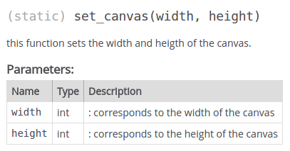
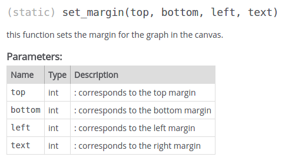
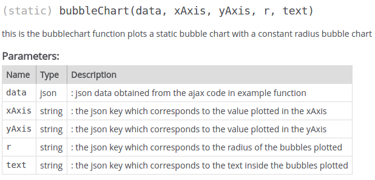
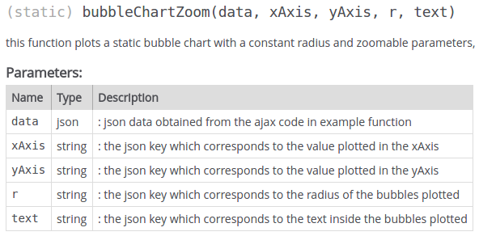
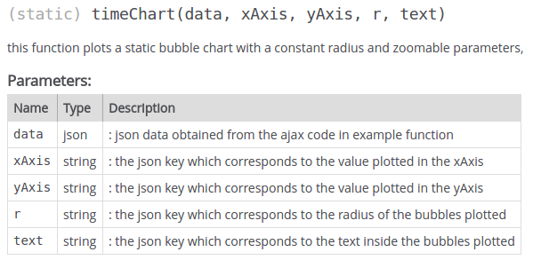
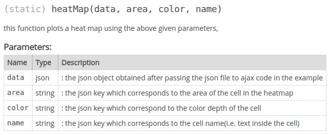
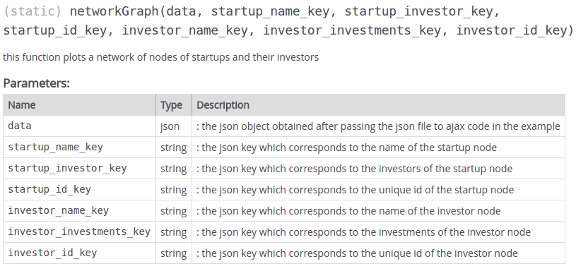

## Welcome to chart.js
Chart.js is simple javascript library bulit using d3.js which lets you scatterplots, heatmaps, and network plots by passing the json data(in a predefined format) and the required chart parameters(like axes, color, margins etc).

### Function definitions
Use global variable graph to invoke all the functions.
















### JSON data formats required for the chart functions

1) Bubble Chart

this is the bubblechart function plots a static bubble chart with a constant radius bubble chart
```
Format :
[
	{
		"Market": "Used Goods Marketplace",
		"Amount": "423225136",
		"Last_Transaction_Date": "2016-07-23",
		"Investment_Count": "14"
	},
    .
    .
    .
    .
]
```
2) Bubble Chart Zoom

this function plots a static bubble chart with a constant radius and zoomable parameter
```
Format : 
[
	{
		"Market": "Used Goods Marketplace",
		"Amount": "423225136",
		"Last_Transaction_Date": "2016-07-23",
		"Investment_Count": "14"
	},
    .
    .
    .
    .
]
```
3) Time line chart

this function plots a static bubble chart with a constant radius and zoomable parameters,
```
Format : 
 {  "Skill development":{  
      "amount":2095630,
      "data":[  
         {  
            "brand_logo":null,
            "brand":"TapChief",
            "entity":"Pilani Experts Technology Labs Private Limited",
            "amount":997815,
            "photo":"",
            "date":"2016-10-01",
            "investor_name":"Radhakrishna Nalabothu"
         },
         .
         .
         .
      ],
    "name":"Skill development"
   },
      .
      .
      .
      .
 }
```
4)heatMap

this function plots a heat map using the above given parameters,
```
Format : 
{ "Market" : "Sector",
  "children" : [
  {
    "Market": "Used Goods Marketplace",
    "Amount": 423225136,
    "Last_Transaction_Date": "2016-07-23",
    "Investment_Count": 14
  },
  .
  .
  .
  .]
}

```
5)networkGraph

this function plots a network of nodes of startups and their investors
```
Format : 
[
  {
    "name": "Eko India Financial Services Private Limited",
    "investors": [
      {
        "investments": 2,
        "id": 5526,
        "name": "Share India Commodity Brokers"
      },
      .
      .
      .
      .
    ],
    "id": 4
  },
  .
  .
  .
  .
]
```
